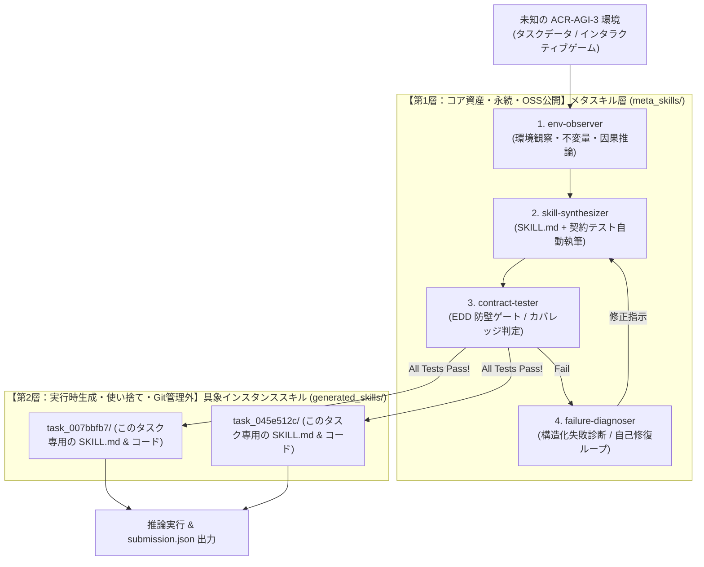

# ACR-AGI-3 メタスキル駆動型自己進化アーキテクチャ (Architecture & Philosophy)

> **"Intelligence is the efficiency of skill acquisition on novel, unseen tasks."**
> — François Chollet (Creator of ARC)

本ドキュメントは、**ARC-AGI-3 (ARC Prize 2026)** において、なぜ「問題解決スキルそのもの」ではなく**「未知の環境に適応するためのメタスキル（Meta-Skills）」** を開発・オープンソース化するのか、その設計思想とシステム構造を規定した公式アーキテクチャ仕様書です。

**本プロジェクトに参加するすべての開発者および AI エージェントは、本原則に従って開発・推論を行ってください。**

---

## 1. コア設計思想：2層の明確な分離

ARC-AGI-3 の環境は不定であり、タスクごとに未知のルールと力学（物理法則、幾何変換、因果関係）が次々に現れます。
過去のゲームで使った固定的な解法スクリプト（「赤いブロックを移動」「3x3にタイリング」等）をいくらリポジトリに集めても、未知のゲームには通用せず、リポジトリがゴミコードで肥大化するだけです。

したがって、本プロジェクトでは**「メタスキル層」**と**「具象インスタンススキル層」**を物理的かつ概念的に完全に分離します。



### 比較表

| 項目 | 第1層：メタスキル (`meta_skills/`) | 第2層：具象インスタンススキル (`generated_skills/`) |
| :--- | :--- | :--- |
| **定義** | **「どのように思考し、どのようなスキルを作るべきか」** を規定する認知エンジン | メタスキルが未知のゲームに遭遇した瞬間に**その場でオンデマンド量産する個別スキル** |
| **役割** | 環境の観察、スキルの自動執筆、正例/負例テストの設計、バグ自己修正 | 目の前の 1 タスクを解くための具体的な Python 変換コード |
| **ライフサイクル** | **永続的**（人間と AI が洗練させ続ける唯一の資産） | **一時的 / キャッシュ**（タスク解決後に破棄または一時保存） |
| **Git 管理** | **コミット対象（OSS として世界へ公開）** | **`.gitignore` 対象（リポジトリを汚染しない）** |
| **品質保証** | EDD (Evaluation Driven Development) の厳格な契約テスト | 実行時の全勝ゲート通過を必須とする |

---

## 2. 4段階の自律的メタ認知サイクル

未知の ACR-AGI-3 環境に直面したとき、エージェントは以下のメタ認知ループを自律的に回します：

### ① 観察・因果推論 (`env-observer`)
* **入力**: 入出力グリッド、またはゲームの操作ログ（人間 VCGT 思考ログ含む）。
* **推論**: 変化しない要素（背景色、不変量）、対称性、移動、色の置換、物体同士の接触関係などの**抽象的な幾何・論理パターン**を抽出する。

### ② スキル自動合成 (`skill-synthesizer`)
* **仕様化**: 抽出されたパターンを再現するための **`SKILL.md` 仕様書（YAML frontmatter ＋ Markdown）** を自動設計する。
* **契約テストの設計**: 入力グリッドを「正例（Positive 3件）」、境界値・エッジケース（非正方、空、はみ出し）を「負例（Negative 3件）」としてテストコードを生成。
* **スクリプト生成**: 仕様を満たす決定論的 Python コードを合成する。

### ③ EDD 防壁ゲート (`contract-tester`)
* **検証**: `edd validate` および `pytest` を自律実行。
* **原則**: **契約テスト（正例3＋負例3）で 1 件でも失敗（境界値バグ、例外エラー）があれば絶対に採用しない**（防壁ゲート）。

### ④ 失敗診断・自己修復 (`failure-diagnoser` / Evolver)
* **診断**: なぜテストが落ちたのか、不一致のセル数、形状エラー、例外トレースバックを構造化解析。
* **修正フィードバック**: メタスキル自身がプロンプトやコードの欠陥を修復し、合格するまで自己修正ループを回す。

---

## 3. ディレクトリ構造

```text
acr-agi3-edd-agent/
├── meta_skills/                       # ★【OSS コア資産】思考・スキル量産のメタスキル群
│   ├── env-observer/                  # 1. 未知環境の不変量・対称性・因果関係を抽出するメタスキル
│   │   ├── SKILL.md
│   │   └── scripts/
│   ├── skill-synthesizer/             # 2. 観察結果から SKILL.md と契約テストを自動執筆するメタスキル
│   │   ├── SKILL.md
│   │   └── templates/
│   ├── contract-tester/               # 3. EDD 防壁ゲート（テスト全勝の検証・カバレッジ診断）メタスキル
│   │   └── SKILL.md
│   └── failure-diagnoser/             # 4. テスト失敗時の構造化診断と自己修復（Evolver）メタスキル
│       └── SKILL.md
│
├── generated_skills/                  # ★【実行時生成】オンデマンド量産されたタスク特化スキル群
│   └── .gitignore                     # Git 管理外（一時キャッシュ）
│
├── skills/seeds/                      # 検証・初期ブートストラップ用のシードスキル群
│   └── grid-analyzer/                 # 静的解析・対称性検出シード
│
├── src/acr_agi3/
│   ├── meta/                          # メタ認知オーケストレーション基盤
│   │   ├── observer.py                # 環境不変量抽出器
│   │   ├── factory.py                 # スキル自動生成工場 (Skill Factory)
│   │   └── gatekeeper.py              # EDD 防壁ゲートキーパー
│   ├── agent/                         # ローカルLLM/VLM 推論アダプター (Qwen2.5-Coder/VL)
│   ├── dsl/                           # 最小限の基底幾何プリミティブ & グリッドレンダラー
│   └── submission/                    # Kaggle 提出用オフラインバンドラー
│
├── data/
│   ├── human_vcgt/                    # 人間のプレイ思考ログ（メタスキルの改善・学習源）
│   └── raw/                           # ARC 公式データセット
│
├── ARCHITECTURE.md                    # 本仕様書（思想と構造の定義）
├── AGENTS.md                          # AI エージェント向け運用ガイドライン
└── README.md                          # プロジェクト概要
```

---

## 4. AI エージェント（LLM/VLM）への行動指針 (Operating Principles)

本プロジェクトで作業する AI エージェントは、以下のルールを厳守してください：

1. **具象コードを `meta_skills/` にコミットしない**:
   * 「特定のパズルを解くためだけのコード」を `meta_skills/` に追加してはならない。
   * 新しいパズルに出会ったら、`meta_skills/` の仕組みを使って `generated_skills/<task_id>/` にコードをオンデマンド生成すること。
2. **EDD（評価駆動開発）防壁ゲートの厳守**:
   * スキルを生成する際は、必ず **「正例 3 件 ＋ 負例 3 件」の契約テスト** を同時に設計すること。
   * テストが 100% 通過（全勝）するまで、そのスキルを推論パイプラインに投入してはならない。
3. **完全オフライン保証**:
   * 提出時・推論時のコードはインターネット遮断下（Kaggle 本番環境）で動作しなければならない。
   * 外部 API への依存コードを提出用パイプラインに含めないこと。
