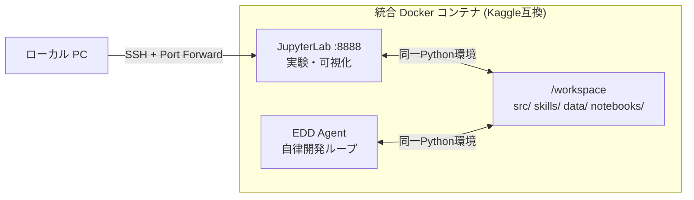

# ACR-AGI-3 Self-Evolving EDD Agent
**ARC Prize 2026 (ARC-AGI-3) に向けた、評価駆動開発（EDD）型自己進化エージェント基盤**

[](LICENSE)
[](https://www.python.org/)
[](https://github.com/google/adk)

本プロジェクトは、Google ADK 2.0 および [`skill-edd-agent`](https://github.com/magic-sword/skill-edd-agent) の自己進化アーキテクチャを活用し、**ARC-AGI-3 (ARC Prize 2026) コンテストに出場する推論エージェントと問題解決スキルを自律的に開発・自己改善・評価する**ためのプロジェクトです。

---

## 🏛 アーキテクチャ概要

```mermaid
graph TD
    A[gcr.io/kaggle-gpu-images/python<br/>Kaggle 公式 GPU イメージ] -->|ベース環境| B[acr-agi3-edd-agent<br/>本プロジェクト]
    C[skill-edd-agent<br/>EDD フレームワーク] -->|依存/連携| B
    B --> D[skills/<br/>ARC ドメイン特化スキル群]
    B --> E[src/acr_agi3/<br/>エージェント・DSL・評価パイプライン]
    B --> N[notebooks/<br/>JupyterLab 実験ノートブック]
    D -->|Evaluation Gating / 契約テスト| F[ARC-AGI-3 Benchmark & Submission]
    E -->|Pass@k 算出| F
    N -->|動作確認・可視化| E
```

### 統合開発環境の設計思想

**「エージェントの実行環境 = JupyterLab環境 = Kaggle提出環境」** を一致させることで、開発→テスト→提出のギャップを最小化します。



### レイヤー構成

1. **環境層 (Kaggle 公式 GPU イメージ)**:
   - `gcr.io/kaggle-gpu-images/python:latest` をベースに Python 3.12, PyTorch, CUDA 環境を提供。
   - Kaggle 提出環境と同一ランタイムを保証。
2. **フレームワーク層 ([`skill-edd-agent`](https://github.com/magic-sword/skill-edd-agent))**:
   - Evaluation Gating（テスト全勝を必須とする防壁）、自己修復ループ、`edd` CLI を提供。
3. **ドメイン層 (`acr-agi3-edd-agent`)**:
   - ARC-AGI-3 のタスクデータ、推論 DSL、幾何変換・物体抽出・探索スキル群、提出用バンドラー。

---

## 📂 プロジェクト構成

```text
acr-agi3-edd-agent/
├── .devcontainer/
│   └── devcontainer.json          # Dev Container 定義 (Docker Compose 連携)
├── .github/
│   └── workflows/
│       └── test.yml               # CI: Ruff Lint & Pytest
├── Dockerfile                     # Kaggle公式GPUイメージベースの開発環境
├── docker-compose.yml             # GPU対応 Docker Compose 定義
├── .env.example                   # 環境変数テンプレート (認証情報)
├── data/                          # ARC-AGI-3 データセット (Git 管理外)
│   ├── raw/                       # 公式タスク (arc-agi_training_challenges.json 等)
│   ├── generated/                 # エージェント自己生成の合成タスク
│   └── solutions/                 # 解答データ
├── notebooks/                     # JupyterLab 実験ノートブック
│   ├── 00_environment_check.ipynb # 環境確認 (Python, GPU, パッケージ)
│   └── submission_template.ipynb  # Kaggle 提出用テンプレート
├── scripts/
│   ├── download_arc_data.py       # ARC データダウンロードスクリプト
│   └── start.sh                   # コンテナ起動スクリプト
├── skills/                        # ARC-AGI-3 特化の自己改善スキル群
│   └── grid-analyzer/             # グリッド形状・色・対称性静的解析スキル
│       ├── SKILL.md               # スキル仕様書 (Markdown-First)
│       ├── scripts/               # 決定論的スクリプト
│       └── tests/                 # EDD 契約テスト (正例3 + 負例3)
├── src/
│   └── acr_agi3/
│       ├── agent/                 # 推論エージェント (Orchestrator, Hypothesis, Verifier, Evolver)
│       ├── dsl/                   # ARC ドメイン固有言語 (Primitives, Interpreter)
│       ├── eval/                  # 評価ハーネス & メトリクス (Pass@k, Exact Match)
│       └── submission/            # Kaggle / コンテスト提出用バンドラー
├── tests/                         # 全体統合・疎通テスト
├── pyproject.toml                 # uv / pip パッケージ定義
└── README.md
```

---

## ⚙️ セットアップ

### 前提条件

- **Docker** (20.10+) & **Docker Compose** (v2+)
- **NVIDIA Container Toolkit** (GPU利用時)
- **Git**

### 1. リポジトリのクローン

```bash
git clone https://github.com/magic-sword/acr-agi3-edd-agent.git
cd acr-agi3-edd-agent
```

### 2. 環境変数の設定

```bash
# テンプレートをコピー
cp .env.example .env

# エディタで開き、各項目を設定
vi .env
# 設定が必要な項目:
#   GEMINI_API_KEY    - LLM API キー (https://aistudio.google.com/)
#   KAGGLE_USERNAME   - Kaggle ユーザー名
#   KAGGLE_KEY        - Kaggle API キー (https://www.kaggle.com/settings)
```

> **⚠️ セキュリティ:** `.env` は `.gitignore` に含まれており、Git にコミットされません。

### 3. Docker 環境の起動

```bash
# ビルド & 起動 (初回はKaggle公式イメージのpullに時間がかかります)
docker compose up -d

# ログの確認
docker compose logs -f
```

### 4. JupyterLab へのアクセス

```bash
# SSH ポートフォワーディング (ローカル PC から)
ssh -L 8888:localhost:8888 user@server

# ブラウザで開く
# http://localhost:8888
```

### 5. 環境の確認

JupyterLab で `notebooks/00_environment_check.ipynb` を開いて実行し、環境が正しく構築されていることを確認してください。

### 6. コンテナ内での作業

```bash
# コンテナ内シェルに入る
docker compose exec kaggle-dev bash

# テスト実行
pytest -v

# Ruff による静的解析
ruff check .
```

---

## 🚀 自律開発・評価ワークフロー

```bash
# 1. 静的解析とコード検証
ruff check .

# 2. 契約テスト・統合テストの実行 (防壁ゲート)
pytest -v

# 3. スキル仕様・Frontmatter の静的バリデーション (EDD)
edd validate skills/grid-analyzer

# 4. スキルの評価とカバレッジ計測
edd eval grid-analyzer --coverage

# 5. 失敗時の構造化診断
edd diagnose grid-analyzer
```

---

## 🏆 Kaggle 提出

`notebooks/submission_template.ipynb` をベースに提出用ノートブックを作成します。

**重要な制約事項:**
- Kaggle 評価環境では **インターネット接続なし**
- 外部 API (Gemini, Claude 等) は **利用不可**
- 必要な依存はすべて **オフライン** で提供する必要あり
- 実行時間: **最大 9 時間**
- GPU: **RTX Pro 6000 (96GB VRAM)**

---

## 📝 ライセンス

[MIT License](LICENSE)