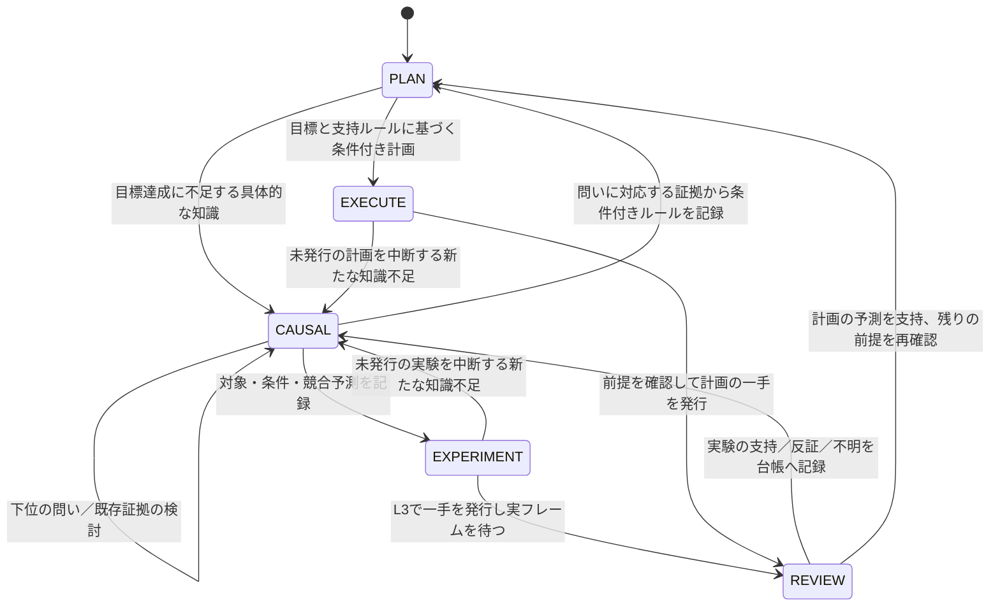

# ADK 2.0 ゲームエージェントの証拠に基づく状態機械

2026-09-23。設計根拠は `LOCAL_LLM_ZERO_SCORE_ANALYSIS_20260922.md`。
この文書は今回の変更を記述する。分析レポートに列挙された全能力の実装完了を意味しない。

## 構成と責務

実行経路は `MyAgent → DeliberativeGamePlayer → ADK Agent / Runner → SkillHarness / SkillToolset`。
ADK公式のスキル開示とツール呼び出しを維持し、認知状態の契約を `ThoughtState`、
原フレームの対象領域検証を `agent/evidence.py`、画面閲覧の範囲を `ScreenTools` に分離した。
ローカルVLMは対象の意味・仮説・計画を提案し、ホストは根拠の参照、領域、合法遷移、
一手制限と予算を検査する。許可されないツールを別ツールへ変換したり、モードを自動昇格したりしない。

リセット・レベル変更は通常の知識推論と区別した境界イベント。実行意図を破棄しPLANへ戻す。
PLANへの境界復帰は明示的に許可するが、EXECUTEへの迂回には使えない。

## 各モードの契約

| モード | 必要な入力と成果物 | 終了条件／拒否条件 |
|---|---|---|
| PLAN | 観測した目標または明示的な目標不明、サブゴール、条件付きルール、短い計画 | 計画の各手に操作・前提・期待結果・対象領域・変化予測が揃うとEXECUTE。不足する知識はCAUSALへ |
| CAUSAL | 固有IDを持つ未解決の問い、関連する結果と仮説 | 関連する支持／反証から限定的ルールを記録し親の思考へ復帰。不明だけでは解決不可。追加実験には既存証拠で足りない理由を要求 |
| EXPERIMENT | 仮説ID、問いID、観測条件、対象領域、予測、競合説明、必要なら再実験理由 | 実際の操作をこの予測へ結び付け、L3で一手だけ発行。古い対象フレーム、無理由の同一盤面・同一介入を拒否 |
| REVIEW | 保留中の行動、その前後フレーム、対象領域全体の閲覧、モデルの支持／反証／不明判定 | 原画像上の必要条件を検査し、結果IDと仮説状態を更新。計画失敗は専用の診断問いIDへ結果を関連付け、元の操作記録を改変せず再利用する。矛盾した支持判定はREVIEWに留め、モデルへ再判断を要求 |
| EXECUTE | 計画先頭の操作、現在の観測と条件、支持ルール | 計画と異なる操作を拒否。各手の後にREVIEW。残りの計画は次フレームで前提を再確認してから再開 |

観測は全モードで読み取り専用。クリックは引き続き `move_cursor → observe_screen → click_at_cursor`。
内部照準の移動・観測を環境アクションとして数えない。観測済み照準の座標をクリック時に変更できない。

## 証拠と反証の台帳

- `question_id` は同じ文章の問いを開き直しても別IDとなる。過去の同文の問いや別レベルの結果を無条件に流用しない。
- `hypothesis_id` は問い、条件、対象、予測、競合説明、以前の結果IDと結び付く。レビューで `untested → supported/refuted/inconclusive` を更新する。
- `target` は原フレームの `x, y, width, height, description`。ホストが観測時の `frame_id` を付ける。移動予測なら出発位置と予想先を含む効果領域を選ぶ。
- `expected_visual_change` は対象領域内の変化の真偽であり、画面全体の変化ではない。HUDだけが変わっても対象の変化予測は支持できない。
- cropで対象外しか見ていない場合はレビューできない。前後の形状が異なる場合は比較不能として支持を拒否し、不明等の判断を許容する。
- `resolve_question` は現在の問いに属する結果のみ受理。不明な証拠しかない場合はADKにツールを公開せず、動的ガイダンスも観測の見直し・追加実験へ切り替える。不明、無関係な証拠、支持と反証が混在したままのルール化を拒否する。条件を絞った新しい問いや識別実験が必要となる。
- 反証のみから得たルールは「この条件で予測が成立しなかった」という制限であり、期待効果を実行する根拠には使えない。
- 反証には盤面ハッシュ・操作・座標・予測文を持つ制約を保存する。同じ盤面で同じ操作・同じ予測を計画として再発行する場合はCAUSALで再考させる。操作ID全体を禁止しない。理由を伴う識別実験は可能。
- モデルコンテキストには直近8仮説・16制約を開示する。状態内部には台帳を保持し、逐次ログに各更新を保存する。

**この検査は意味認識の証明ではない。** 領域内のアニメーションや誤った対象指定を完全には判別できない。
領域の変化と「ドアが開いた」「目標を達成した」は別であり、対象の意味的真偽は依然としてVLM判断に依存する。

## 中断時にも残る実行ログ

評価の `logs/runs/<run_id>/` に、従来のmanifest・環境別JSONに加え
`environment_NNN.events.jsonl` を追記する。`--output-dir` 指定時はその配下に保存する。
イベントごとにファイルを閉じ、正常終了前でも既に書かれたイベントを読める。電源断時の永続化を保証するfsync方式ではない。

各イベントには通番、時刻、ゲームID、レベル、フレームID、モード、状態revisionを付ける。

| イベント | 記録する情報 |
|---|---|
| deliberation_start | 原フレーム、開始時の思考状態、LLM呼び出し上限 |
| model_io / input | 入力テキスト、公開ツール、画像寸法・モード・画素ハッシュ |
| model_io / prepared_input | 実モデルに渡すチャットテンプレート適用後のテキスト、入力トークン数・画像数・上限 |
| model_io / output | モデル生出力、実モデルの出力トークン数 |
| tool_start / tool_end | 呼び出し引数、応答、前後のモード・revision、更新後の証拠。画像base64は除きcrop・フレーム・照準情報を保存 |
| guard_rejected | 拒否したツールと具体的な理由。別操作への置換はしない |
| level_boundary | 変更後レベルと破棄する保留行動 |
| deliberation_end | 行動選択の成否、所要時間、残予算、終了時の思考状態 |

推論開始前に入力を保存するため、モデル例外・OOM・プロセス中断でも直前の入力が残る。
通常の例外は環境別JSONのスタックと終了理由にも保存する。プロセス強制停止では終了イベントや最終JSONは残らない場合がある。
巨大な履歴は詳細ログ側へ保存し、ゲームAPIのreasoningへは送らない。完全オフライン動作を維持する。

## 採用検証と残る範囲

契約テストは支持→ルール→PLAN→EXECUTE、HUDのみの変化、対象外crop、同文の別の問い、
反証の誤用、追加実験の理由、比較不能、禁止遷移、推論失敗前のログ保存を含む。
実ローカルモデルの記録とテスト結果は以下に追記する。自動テストの成功を攻略性能の成功とは扱わない。

今回の対象は5モードの証拠・遷移契約と実行計測。逆算計画の依存グラフ探索器、退避先の自動選択、
新しい禁忌学習スキルの接続、条件付きマクロ生成・転移は未実装。現在の計画はVLMが提案する短い条件付き列である。
公開するスキルは引き続き3つであり、旧ヘルパーをそのまま再接続していない。

### 実ローカルモデルでの検証（1回目）

Qwen2.5-VL-3B / FT09 / 上限2手 / 呼び出し上限24回。
`logs/verification_state_machine/runs/a8195f8a1b8e4c9fa9634a2e2d0d6aee/` に原ログを保存。
実行された1手は照準を観測した後のクリック。モデルの誤った支持判定を対象領域比較で拒否し、
モデルは不明へ変更した。ただし、その不明な証拠からルール化を繰り返し、推論予算で終了した。
この記録を根拠に、不明証拠しかない場合のresolve_question非公開とガイダンス分岐を追加した。
「目標は右上」との根拠のない知覚判断も残っている。実機でEXECUTEへ到達したとの結果ではない。

### 実ローカルモデルでの検証（2回目）

`logs/verification_state_machine_v2/runs/e9671fa65e764cc6b03bc5a43c31b279/`。
不明な証拠からのルール確定は公開制御で防止でき、モデルは追加実験へ進もうとした。
しかし再実験理由（retry_reason）の欠落を修正できず、1手後に推論予算超過となった。
204件の逐次イベントが保存され、入力・生出力・ガード拒否・終了理由を追跡できた。
実モデルのEXECUTE到達・スコア改善は未確認（クリア0）。この実行後、反証制約が別の支持済み効果まで
禁止しないよう、照合を同じ予測文に限定する修正を加え、回帰テストで検証した。

### 自動検証

全体テスト・既存3スキル契約・追加ワークフロー契約は245件合格（依存ライブラリ等の警告17件）。
変更コードのRuff F/Iチェックとgit diff --checkも合格。
スキルはEDD MCP検証でエラー0・警告0、skill-creatorの形式検証にも合格。
