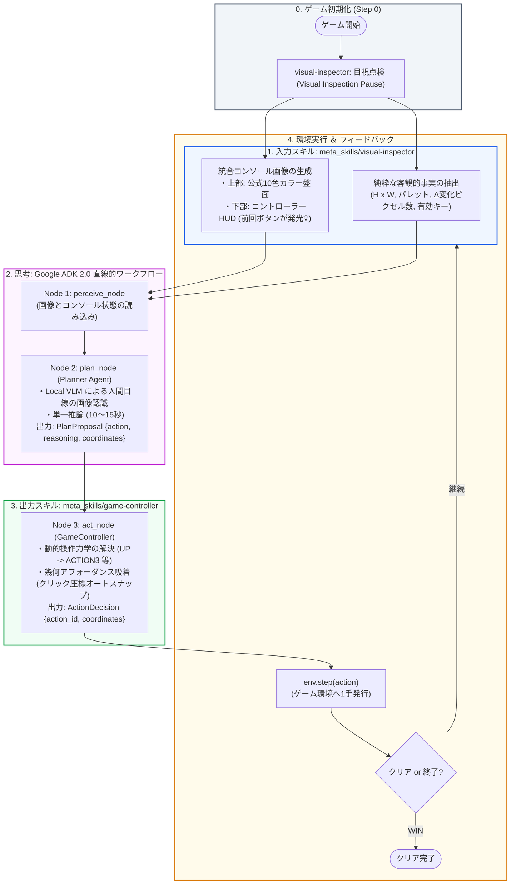

# ARC-AGI-3 一新された処理フロー仕様書 (Current Workflow)

本ドキュメントは、複雑な多分岐ルーティングや旧世代コードを全廃し、**「入力スキル（visual-inspector）」＋「思考（Planner）」＋「出力スキル（game-controller）」** の3本柱に一新された最新の処理フローをまとめたものです。

---

## 1. 全体構造マップ (ASCII ＆ フロー)

```
┌─────────────────────────────────────────────────────────────────────────────┐
│ 0. ゲーム初期化 (Step 0)                                                      │
│    └─ visual-inspector: 目視点検 (Visual Inspection Pause: 初期盤面の把握)     │
└──────────────────────────────────────┬──────────────────────────────────────┘
                                       │
                                       ▼
┌─────────────────────────────────────────────────────────────────────────────┐
│ 1. 入力スキル: meta_skills/visual-inspector (画面認識・事実抽出)             │
│    ├─ [画像生成] 統合コンソール画面 (公式10色カラー盤面 ＋ コントローラーHUD)    │
│    │             ※ HUD上で前回押したボタンが発光(💡)して因果関係を可視化    │
│    └─ [事実抽出] 純粋な客観的事実 (盤面サイズ、色一覧、Δ変化ピクセル数、有効キー) │
│    ★ プログラムによる「自機」「ゴール」の勝手な決めつけは全廃。                │
│       人間と同じように、LLM/VLMが画面全体を見て状況を判断。                  │
└──────────────────────────────────────┬──────────────────────────────────────┘
                                       │
                                       ▼
┌─────────────────────────────────────────────────────────────────────────────┐
│ 2. 思考: Google ADK 2.0 直線的ワークフロー (Linear Cognitive Workflow)       │
│                                                                             │
│    [ Node 1: perceive_node ]                                                │
│      └─ 画像キャンバスと客観事実を CognitiveState に読み込み                  │
│                        │                                                    │
│                        ▼                                                    │
│    [ Node 2: plan_node (Planner Agent: Local Qwen-VL / Transformers) ]       │
│      ├─ 人間目線での状況理解 ＆ 目標設定 (単一推論: 10〜15秒)                 │
│      ├─ 0-リジェクト（レビューの堂々巡りループを全廃）                        │
│      └─ 出力: PlanProposal { action: "UP", reasoning: "...", coords: ... }  │
└──────────────────────────────────────┬──────────────────────────────────────┘
                                       │
                                       ▼
┌─────────────────────────────────────────────────────────────────────────────┐
│ 3. 出力スキル: meta_skills/game-controller (決定論的 1手発行)                │
│                                                                             │
│    [ Node 3: act_node (GameController) ]                                    │
│      ├─ 動的操作力学の解決 (resolve_action_id)                               │
│      │   └─ LLMの「UP」指示を、同定済みの物理キーIDへ自動変換 (例: ACTION3)    │
│      ├─ 幾何アフォーダンス吸着 (click_at)                                    │
│      │   └─ クリック座標が省略・空セルの場合、有色オブジェクトの重心へ自動補正│
│      └─ 出力: 100% 確実に環境へ発行可能な ActionDecision {action_id, coords}│
└──────────────────────────────────────┬──────────────────────────────────────┘
                                       │
                                       ▼
┌─────────────────────────────────────────────────────────────────────────────┐
│ 4. 環境実行 ＆ フィードバックループ (Environment Execution)                  │
│    ├─ env.step(action) を実行                                               │
│    ├─ 完了判定:                                                             │
│    │   ├─ WIN (クリア) / GAME_OVER ──► [ 終了 ]                             │
│    │   └─ 継続 ──────────────────────► [ Step + 1 として 1. 入力スキルへ戻る ]│
└─────────────────────────────────────────────────────────────────────────────┘
```

---

## 2. Mermaid フロー図



---

## 3. なぜこの設計が強力なのか？（以前の複雑な設計との違い）

| 比較項目 | 以前の設計（多分岐・レビュー・仮説進化） | 一新された新設計（本構成） |
| :--- | :--- | :--- |
| **画面認識** | プログラムが勝手に自機やゴールを決め打ち推測（誤認が多発） | **プログラムによる決めつけを全廃**。公式10色カラー画像＋HUDをそのままLLMに見せて判断 |
| **思考フロー** | 5分岐ルーティング ＋ Reviewer（堂々巡りのリジェクトループでタイムアウト） | **直線的 ADK 2.0 ワークフロー（Perceive ➔ Plan ➔ Act）**。単一推論で0-リジェクト |
| **メタスキル数** | 6個の複雑なメタスキル（契約テスト、仮説進化、長期記憶など） | **2個の役割特化スキル（入力: visual-inspector, 出力: game-controller）** に集約 |
| **操作出力** | キーの対応関係がゲームごとに異なるARCで空振り | `game-controller` が**動的操作力学とクリック座標吸着を解決し、100% 確実に1手を発行** |
| **推論速度** | 1手あたり 40〜90秒（Kaggleで時間切れ） | **1手あたり 10〜15秒** で高速にループ |

---

> **画像ファイル**: 上記フローをグラフィカルに可視化した高解像度 PNG 画像が `docs/architecture_workflow.png` に生成されています。
