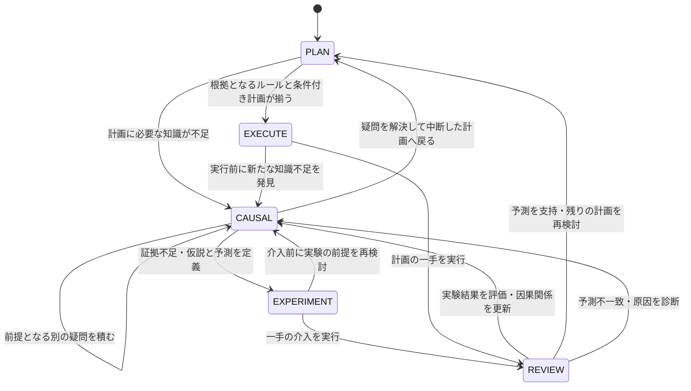

# 現在のゲームプレイ・ワークフロー

公式エントリーポイント `MyAgent` は `DeliberativeGamePlayer` を使用する。
最初の思考状態は **PLAN（ゴールからの逆算）**。必要な知識が足りないときに
因果推論へ移り、その推論に証拠が足りない場合に初めて実験する。
観測はどの思考状態でも呼べる読み取り専用スキルであり、固定の最初の工程ではない。

## 思考状態と遷移

状態を決めるのは経過手数や画面差分の量ではなく、モデルがツールに明示する
知識不足・実験意図・観測結果である。Python は状態遷移の妥当性、根拠ID、
観測フレーム、実行可能な操作を検査する。因果解釈の正しさ自体を保証するものではない。

`need_causal_knowledge` は疑問・復帰先・中断したゴールをスタックに保存する。
疑問の中で別の疑問が発生しても、内側から解決して呼び出し元に戻れる。
見れば分かる事実は `answer_visible_question`、既知のルールで解ける疑問は
`use_known_rules` で解決でき、毎回の実験は強制しない。

実験には仮説・予測・対立する説明が必要。実際の一手と前後フレームを結び付け、
`assess_result` で supported / refuted / inconclusive を記録する。
`resolve_question` は評価済み証拠を引用した条件付きルールを暫定知識として保存する。
不明瞭な結果だけでは疑問を解決できない。失敗しても既知のルールを一括削除しない。

計画はサブゴール、参照ルール、各手の前提条件・予測結果を保持する。
一手ごとに結果を確認し、次の前提を観測して `continue_plan` する。
実行前に疑問が生じた場合は、未実行の計画・実験を破棄して推論に戻れる。

## 思考中のオンデマンド観測

1. Gateway が最新画面を `ScreenTools.publish` に渡す。この時点では画像をモデルに渡さない。
2. モデルが公式 ADK `load_skill("visual-inspector")` で観測手順を読み込む。
3. `observe_screen` を呼ぶと、公式レンダラーで作成した PNG がツール結果に含まれる。
4. `LocalQwenVL` がその画像を復号し、次のローカルマルチモーダル推論に実画像として渡す。

`view="current"` / `"previous"` / `"both"` と矩形切り出しに対応する。
前後比較では2枚の画像を渡す。観測はゲーム操作もリセットも行わず、どの思考状態でも利用できる。
画面を見直してもゲーム時間は進まない。見られるのは Gateway が最後に渡した画面である。
クリックは拡大後の画像座標ではなく、元のゲーム座標を使用する。

## 実行と境界

- `SkillHarness` → 公式 ADK `SkillToolset` を使用し、カタログ・手順・ツールを段階的に開示する。
- 現行ランタイムのスキルは `causal-deliberation`、`visual-inspector`、`game-controller`。
- 環境操作は `step_action` / `click_at` / `reset_game` の Level 3 ツール経由のみ。
- 一つの Gateway フレームに対して一手だけ選ぶ。自由文や誤ったスキル名を操作に読み替えない。
- 戦略的リセットには診断と変更後の方針が必要。同じ盤面へのリセットを繰り返さない。
- 開始・ゲームオーバーの初期化リセットは `MyAgent` が操作ツールを通して処理する。
- ゲームごとに因果知識を分離する。同じゲームの再開ではルールを保持し、古い観測事実と実行意図は破棄する。
- レベル移行時はルールを暫定的に保持し、目標・計画・前提を再確認する。
- 推論予算内に根拠ある操作を選べない場合は `DeliberationBudgetExceededError` で終了する。
  無関係な一手を補ってスコア測定を継続しない。

## 実装と検証範囲

- `src/acr_agi3/agent/deliberation.py`: 思考状態・疑問スタック・証拠・条件付きルール。
- `src/acr_agi3/agent/deliberative_player.py`: ADK セッションと状態を操作するツール。
- `src/acr_agi3/tools/screen_tools.py`: 副作用のない画像観測。
- `src/acr_agi3/agent/llm/local_vlm.py`: ツール画像をローカル VLM に届けるアダプター。
- `tests/test_deliberative_player.py`: スクリプト化したモデルを使う ADK 統合テストと境界テスト。

旧 `ADKGamePlayer` とその認知ワークフローは比較・回帰検証用に残しているが、
公式 `MyAgent` の実行経路やフォールバックには使用しない。
`submission/entrypoint.py` は別の簡易環境向け従来評価器で、ヒューリスティック救済処理を持つ。
新設計の検証・スコア測定には、公式 `MyAgent` を使用する `scripts/run_local_leaderboard.py` を使う。

統合テストは状態遷移と画像伝達、操作制約を検証する。実モデルが適切な仮説や逆算計画を
生成できるか、およびリーダーボードスコアが改善するかは、別途実ゲームで測定する必要がある。
