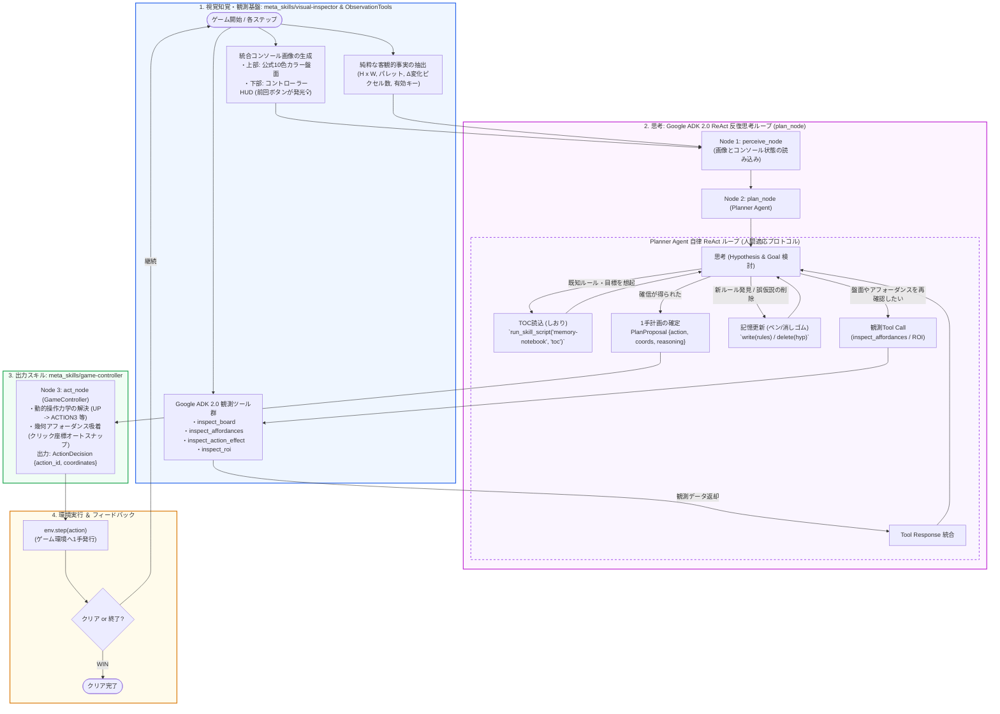

# ARC-AGI-3 一新された処理フロー仕様書 (Current Workflow)

本ドキュメントは、複雑な多分岐ルーティングやベタ書き個別関数（旧 ObservationTools）を全廃し、**Google ADK 2.0 準拠の 3 フェーズ自律ワークフロー（Node 1: Perceive ➔ Node 2: Plan ➔ Node 3: Act）とノードごとの最小限スキル開示（最小権限の原則）** に一新された最新のゲームプレイ処理フローをまとめたものです。

---

## 1. 全体構造マップ (ASCII ＆ フロー)

```
┌─────────────────────────────────────────────────────────────────────────────┐
│ 1. 視覚知覚・目視点検 (Node 1: Perceive Node)                                │
│    ├─ [統合画面] 公式10色カラー盤面 ＋ コントローラーHUD (前回押下ボタン💡発光)│
│    ├─ [客観事実] 盤面サイズ (H x W)、構成色、Δ変化ピクセル数、有効キー一覧    │
│    └─ [最小権限スキル] meta_skills/visual-inspector (SkillToolset) のみ開示   │
│         • 大域幾何、色分布、ゲシュタルト分類、自機・ゴール・連動ブロックの特定 │
│         • 出力: Visual Observation Summary (盤面状況の客観的要約)            │
└──────────────────────────────────────┬──────────────────────────────────────┘
                                       │
                                       ▼ (観察レポートを引き渡し)
┌─────────────────────────────────────────────────────────────────────────────┐
│ 2. 認知プランニング・記憶 (Node 2: Plan Node)                                │
│    ├─ [人間適応原理] 逆算プランニング (Backward Chaining) ＆ 待避バッファ活用 │
│    └─ [最小権限スキル] meta_skills/memory-notebook (SkillToolset) のみ開示   │
│         • しおり (TOC): `toc --format markdown` で既知知識を極小トークン想起│
│         • しおり (Bookmark): `bookmark current_goal` で重要目標をピン留め   │
│         • ペン (Pen): `write` で新ルール (rules.controls, nogo) を記録      │
│         • 消しゴム (Eraser): `delete` / `clear` で棄却された誤仮説を即座に消去 │
│         • 出力: Immediate Subgoal & Strategy (直近サブゴールとキーストーン)  │
└──────────────────────────────────────┬──────────────────────────────────────┘
                                       │
                                       ▼ (サブゴールを引き渡し)
┌─────────────────────────────────────────────────────────────────────────────┐
│ 3. 1手確定・安全検証 (Node 3: Act Node)                                     │
│    ├─ [最小権限スキル] meta_skills/game-controller (SkillToolset) のみ開示   │
│    │    • 動的操作力学の解決 (UP -> ACTION3 等)                              │
│    │    • 幾何アフォーダンス吸着 (クリック座標オートスナップ)                │
│    │    • 無効ボタン（押せないアクション）のブロック ＆ 再検討 (Re-think)    │
│    └─ 出力: 100% 確実に環境へ発行可能な ActionDecision {action_id, coords}  │
└──────────────────────────────────────┬──────────────────────────────────────┘
                                       │
                                       ▼ (確定した1手を環境へ発行)
┌─────────────────────────────────────────────────────────────────────────────┐
│ 4. 環境実行 ＆ フィードバックループ (Environment Execution)                  │
│    ├─ env.step(action) を実行                                               │
│    ├─ 完了判定:                                                             │
│    │   ├─ WIN (クリア) / GAME_OVER ──► [ 終了 ]                             │
│    │   └─ 継続 ──────────────────────► [ Step + 1 として 1. Perceive へ戻る ]│
└─────────────────────────────────────────────────────────────────────────────┘
```

---

## 2. Mermaid フロー図



---

## 3. なぜこの設計が強力なのか？（以前の複雑な設計との違い）

| 比較項目 | 以前の設計（多分岐・レビュー・仮説進化） | 一新された新設計（本構成: ReAct + ADK 2.0） |
| :--- | :--- | :--- |
| **画面認識** | プログラムが勝手に自機やゴールを決め打ち推測（誤認が多発） | **プログラムによる決めつけを全廃**。公式10色カラー画像＋HUDをそのままLLMに見せて判断 |
| **思考フロー** | 5分岐ルーティング ＋ Reviewer（堂々巡りのリジェクトループでタイムアウト） | **Google ADK 2.0 ReAct 反復思考ループ**。人間適応原理（4フェーズ思考プロトコル）に基づき自律的に観測・記憶・思考 |
| **長期記憶** | 過去の会話ログを全部プロンプトに流し込んでコンテキストパンク | **`meta_skills/memory-notebook`（紙・ペン・消しゴム・しおり）**。目次（TOC）で低トークン想起し、必要な知識のみを選択的展開 |
| **観測ツール** | 一括プロンプト注入（無関係な情報でコンテキストが肥大化） | **オンデマンドな `ObservationTools`**（`inspect_board`, `inspect_affordances`, `inspect_action_effect`, `inspect_roi`）をツール呼出でピンポイント取得 |
| **スキルの拡張性** | 新スキルが増えるたびにプロンプトがパンク | **Google ADK 2.0 公式 `SkillToolset` 準拠**。Level 1（目録）$\rightarrow$ Level 2（`SKILL.md`）$\rightarrow$ Level 3（スクリプト）の段階的開示でスケーラブル |
| **操作出力** | キーの対応関係がゲームごとに異なるARCで空振り | `game-controller` が**動的操作力学とクリック座標吸着を解決し、100% 確実に1手を発行** |
| **推論速度** | 1手あたり 40〜90秒（Kaggleで時間切れ） | **1手あたり 10〜15秒** で高速かつ柔軟に思考ループを回転 |

---

> **画像ファイル**: 上記フローをグラフィカルに可視化した高解像度 PNG 画像が `docs/architecture_workflow.png` に生成されています。
