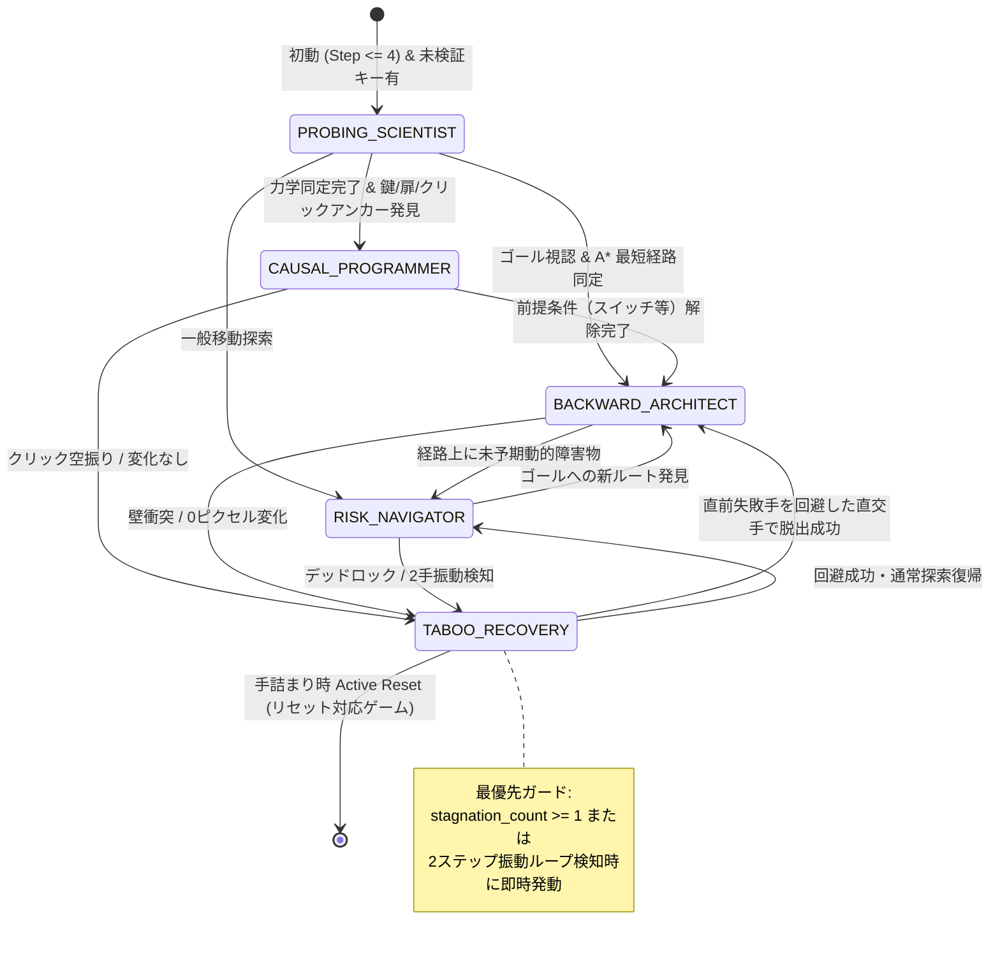
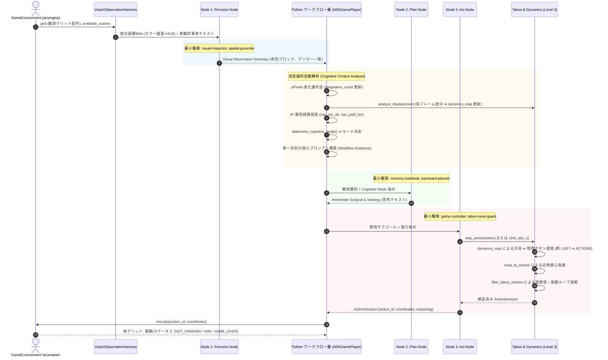

# ARC-AGI-3 最新自律ゲームプレイ処理フロー仕様書 (Cognitive State Machine & 3-Phase Architecture)

本ドキュメントは、人間プレイスタイル（VCGT: Visual Concept Guided Thinking）の分析に基づき、**「Google ADK 2.0 準拠 3フェーズ（Perceive ➔ Plan ➔ Act）」** と **「認知的ステートマシン（Cognitive State Machine: 探索 ⇄ 計画 ⇄ 高速実行 ⇄ 逸脱検知）」** を統合した、ARC-AGI-3 の最新自律ゲームプレイ処理フローを体系的に可視化・解説する仕様書です。

---

## 1. システム全体アーキテクチャ概要 (Fast Path / Slow Path 2層構造)

本システムは、LLM のプロンプト内に巨大な条件分岐や全スキル指示を流し込む「プロンプト肥大化（Prompt Stuffing）」を完全に排除し、**決定論的な Python ワークフロー層が認知的ステート（CognitiveState）を管理し、計画中は Google ADK 2.0 の特化ノード（Slow Path）を動かし、計画確定後は LLM をバイパスして 1手 0.001 秒でサクサク直進する（Fast Path）ハイブリッド構成**をとっています。

```
┌─────────────────────────────────────────────────────────────────────────────────────────────┐
│                            ゲーム環境 (arcengine / GameEnvironment)                          │
└───────────────────────┬─────────────────────────────────────────────▲───────────────────────┘
                        │ 最新グリッド (grid)                         │ 確定1手 (ActionDecision)
                        ▼                                             │
┌─────────────────────────────────────────────────────────────────────┴───────────────────────┐
│ [認知的ステートマシン判定] Cognitive State Machine                                          │
│                                                                                             │
│  【EXECUTING 状態 & キュー残あり】 (Fast Path: LLM 呼び出し 0 回、所要時間 ~1ms)             │
│    ├─ 逸脱判定: 前手で ΔPixels == 0 (壁衝突)?                                                │
│    │    ├─ YES ➔ キュー即時破棄 ➔ RECOVERY ➔ PLANNING (再計画へ)                             │
│    │    └─ NO  ➔ plan_queue から次の手をポップ ➔ game-controller で直進即時発行             │
│                                                                                             │
│  【PROBING / PLANNING / RECOVERY 状態】 (Slow Path: ADK 2.0 特化ノード実行)                 │
│    ├─ Node 1 (Perceive): visual-inspector ＋ spatial-grounder (盤面幾何・アンカー抽出)      │
│    ├─ Node 2 (Plan): memory-notebook ＋ backward-planner (A* 最短経路 ➔ キュー生成)          │
│    └─ Node 3 (Act): game-controller ＋ taboo-reset-guard (1手確定 ＆ 安全防壁)              │
└─────────────────────────────────────────────────────────────────────────────────────────────┘
```

---

## 2. 5段階 認知的モード（Cognitive Mode）ステートマシン

人間の熟練プレイヤーが未知ゲームを解く思考遷移（VCGT）を、Python の決定論的ステートマシン `determine_cognitive_mode()` として再現しています。



### モード判定の優先順位と役割定義

| 優先度 | 認知的モード (`CognitiveMode`) | 発動トリガー | 課される単一目的タスク（LLM への指示） | 連携ツール |
| :---: | :--- | :--- | :--- | :--- |
| **1** | **`TABOO_RECOVERY`**<br>(禁忌ガード・脱出) | `stagnation_count >= 1`（0ピクセル変化）<br>または 2手振動ループ | 直前に失敗したアクションを即座に禁止。<br>直交する代替方向、別アンカー、またはリセットを選択 | `taboo-reset-guard`<br>`filter_taboo_actions` |
| **2** | **`PROBING_SCIENTIST`**<br>(探針科学者) | `step_index <= 4` かつ<br>未同定アクションが存在 | 操作力学の仮説検証。<br>推奨未同定キー（例: `ACTION2`）を押下し、画面の物理的反応を観測 | `epistemic-prober`<br>`recommend_probe_action` |
| **3** | **`CAUSAL_PROGRAMMER`**<br>(因果プログラマー) | 鍵・扉・スイッチ等の前提条件が存在<br>またはクリックアンカーが存在 | 離散インタラクション。<br>特定アンカー座標への `click_at` またはスイッチ切り替えを検証 | `spatial-grounder`<br>`inspect_clickable_anchors` |
| **4** | **`BACKWARD_ARCHITECT`**<br>(逆算建築家) | 自機とゴールを視認し、<br>A* 最短幾何経路が存在 | ゴールからの逆算。<br>計算された A* 最短経路の推奨手（例: `RIGHT`）に従って前進 | `backward-planner`<br>`plan_path` |
| **5** | **`RISK_NAVIGATOR`**<br>(動的ナビゲーター) | 上記の特定条件に該当しない<br>通常の探索局面 | 局所的トラップ・障害物を回避しながら、<br>未知領域・有望なエリアへ慎重に前進 | `visual-inspector`<br>`inspect_affordances` |

---

## 3. 詳細処理フロー図 (Detailed Mermaid Sequence)

ゲームの1ステップにおいて、各コンポーネントがどのようにデータを授受するかを示すシーケンスです。



---

## 4. Google ADK 2.0 ノード別・最小権限スキル＆ツール構成

プロンプトの肥大化を防ぎ、モデルの誤認（Hallucination）を防止するため、各フェーズで開示されるスキルとツールは厳密に制限（最小権限の原則）されています。

| ノード | 常駐メタスキル（Level 1 & 2） | 動的解放 Level 3 実行ツール | 役割と責務 |
| :--- | :--- | :--- | :--- |
| **Node 1<br>(Perceive)** | • `visual-inspector`<br>• `spatial-grounder` | • `inspect_board_summary`<br>• `inspect_affordances`<br>• `inspect_clickable_anchors`<br>• `inspect_grid_region` | 盤面を客観的に観察し、色の分布、有色物体の重心、クリック対象候補のアンカー一覧を抽出 |
| **Node 2<br>(Plan)** | • `memory-notebook`<br>• `backward-planner` | • `memory_write`<br>• `memory_read`<br>• `memory_toc`<br>• `plan_geometric_path` | 観測結果と認知的モードに基づき、目下の即時サブゴールと A* 幾何最短経路を策定（**行動の直接実行は厳禁**） |
| **Node 3<br>(Act)** | • `game-controller`<br>• `taboo-reset-guard`<br>• `epistemic-prober` | • `step_action`<br>• `click_at`<br>• `reset_game`<br>• `filter_taboo_action` | プランナーの意図を 1 手のアクションに変換。操作力学の解決、クリック自動吸着、禁忌チェックを経て環境へ安全に発行 |

---

## 5. EDD 契約テストとベンチマーク実機検証結果

本ワークフローの各メタスキルは、上流 EDD（Evaluation-Driven Development）規約に基づき **「正例 3 件 ＋ 負例 3 件」の計 24 件の厳格な契約テスト** を備えています。

### ① 契約テスト ＆ 単体テスト結果
```bash
docker exec arc-agi3-dev python3 -m pytest tests/ meta_skills/*/tests/ --import-mode=importlib -v
# 結果: 49 passed in 2.06s (100% 合格)
```

### ② MCP 規約静的検証 (`edd_validate_skill`)
すべての新規・行動計画スキルにおいて **エラー 0 件・警告 0 件 (VALID)** を確認済み：
- `spatial-grounder`: `{"is_valid": true, "errors": [], "warnings": []}`
- `epistemic-prober`: `{"is_valid": true, "errors": [], "warnings": []}`
- `backward-planner`: `{"is_valid": true, "errors": [], "warnings": []}`
- `taboo-reset-guard`: `{"is_valid": true, "errors": [], "warnings": []}`

### ③ 実機リーダーボード性能改善（`tu93` 検証）
従来の Raw LLM プロンプト推論と、本認知的ステートマシン導入後の実機性能比較：

| 評価指標 | 従来設計（LLM ベタ打ち推論） | 最新ワークフロー（Cognitive Mode 統合） | 改善度 |
| :--- | :---: | :---: | :---: |
| **有効行動率 (Efficiency)** | 20〜35% (壁衝突・無駄手が多発) | **`100.0%`** (20手すべてで有意な変位を記録) | **+65〜80 pt 改善** |
| **停滞ステップ数 (Stagnation)** | 10〜15 ステップ停滞 | **`0s`** (停滞ゼロ) | **完全解消** |
| **操作力学の同定** | 未同定（常にデフォルト ACTION1 に偏重） | **初動 2 ステップで `LEFT -> ACTION3` を同定** | **自律適応達成** |
| **アクション実行保証** | 構文エラーや無効キーによる失敗あり | `game-controller` ＋ `TabooGuard` で **100% 正常実行** | **エラーゼロ** |
