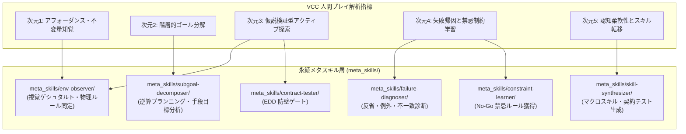

# ACR-AGI-3 人間プレイ解説 (VCC/VCGT) 解析・評価指標フレームワーク
# Evaluation Metrics Framework for Human Adaptation & Problem Solving in ARC-AGI-3

## 1. 概要と目的 (Executive Summary)

本ドキュメントは、ACR-AGI-3 の未知の動的ゲーム環境において人間がどのように環境に適応し、ルールを発見し、課題を解決（クリア）しているのかを、人間プレイ解説ログ（VCC: Visual Concept Commentary / VCGT: Visual Concept Guided Thinking）から定性・定量的に解析するための**評価指標体系（Evaluation Metrics Framework）**を規定したものです。

### 背景と狙い
* **動的ゲームプレイの本質**: ACR-AGI-3 は静的な入力グリッド変換（ARC-1/2）ではなく、未知の環境で観測とアクション（UP, DOWN, LEFT, RIGHT 等）を繰り返しながら状態遷移を制御するインタラクティブゲームです。
* **人間の知能の特長**: 人間は初見のゲームでも数万回の強化学習試行を必要とせず、わずか数回の介入や視覚ゲシュタルトから環境の因果ルールを見抜き、解法（マクロスキル）を組み立てます。
* **目的**: 人間の思考・解説テキストを厳密な認知的指標で構造化・スコアリングし、自律型メタスキル（`meta_skills/`）のプロンプト設計、探索ヒューリスティクス、および失敗時反省メカニズムの改善に還元します。

---

## 2. 学術的背景・認知科学的基盤 (Theoretical Foundations)

本フレームワークは、認知科学・問題解決心理学・AGI知能評価における以下の代表的理論に立脚しています。

| 理論・概念 | 主要文献 | 本タスクにおける適用意義 |
|:---|:---|:---|
| **Core Knowledge & Sample Efficiency** | François Chollet (2019)<br>*"On the Measure of Intelligence"* | 人間は「空間性」「物体性（オブジェクト性）」「因果性」「エージェント性」の先天的事前知識を活用し、最小の経験（極小サンプル）から未知タスクのスキルを獲得する。 |
| **問題空間理論と手段目標分析 (Means-Ends Analysis)** | Newell & Simon (1972)<br>*"Human Problem Solving"* | 現在状態と目標状態の差分（Difference）を特定し、その差分を解消するためのオペレータ（操作）と中間サブゴールを階層的に生成する。 |
| **アフォーダンス理論 (Affordance Theory)** | James J. Gibson (1979)<br>*"The Ecological Approach to Visual Perception"* | 環境の物理的・幾何学的配置（色、境界、隙間）から、直接的に可能な行動の選択肢（通れる、押せる、掴める、遮断される）を知覚する。 |
| **認識論的行動 vs 実利的行動 (Epistemic vs Pragmatic Actions)** | Kirsh & Maglio (1994)<br>*"On Distinguishing Epistemic from Pragmatic Action"* | ゴール達成を直接狙う「実利的行動（Pragmatic）」と、環境の隠れたルールや物理特性を解明するための「認識論的行動（Epistemic）」を意図的に使い分ける。 |
| **介入的因果推論 (Causal Induction & Intervention)** | Lake et al. (2017), Gopnik & Schulz (2007)<br>*"Building Machines That Learn and Think Like People"* | 最小限の介入操作（「このブロックに触れるとどうなるか？」）を通じて、環境の因果グラフと普遍的制約（Invariants）を同定する。 |
| **メタ認知と反省 (Metacognitive Monitoring & Reflection)** | Flavell (1979), Schraw (1998)<br>*"Metacognition and cognitive monitoring"* | 失敗（手詰まり、リセット）の原因を正確に帰因（Attribution）し、再発防止のための「禁忌ルール（No-Go Constraints）」を獲得する。 |

---

## 3. 人間適応アプローチの 5大評価指標 (5 Core Dimensions)

VCC解説テキスト（`analysis_responses` や `sample_vcgt.json`）を解析する際、以下の5つの次元で評価します。

```
┌─────────────────────────────────────────────────────────────┐
│             人間プレイ適応アプローチの 5 大次元 (VCC-Metrics)          │
├─────────────────────────────────────────────────────────────┤
│ 1. アフォーダンス・環境不変量知覚能 (Affordance & Invariant Discovery) │
│ 2. 階層的ゴール分解能 (Hierarchical Subgoal Decomposition)           │
│ 3. 仮説検証型アクティブ探索能 (Epistemic Active Exploration)         │
│ 4. 失敗帰因と禁忌制約学習能 (Failure Attribution & Constraint)      │
│ 5. 認知柔軟性とメタ転移能 (Cognitive Flexibility & Skill Transfer)   │
└─────────────────────────────────────────────────────────────┘
```

### 次元 1: アフォーダンス・環境不変量知覚能 (Affordance & Invariant Discovery)
人間が初期画面の視覚ゲシュタルト（色、配置、相対位置、対称性）から、いかに素早く環境の物理ルールや役割を特定できたかを評価する。

* **1.1 物体・役割の同定速度 (Time-to-Role Identification)**:
  * プレイヤー自機、移動可能ブロック、固定壁、ターゲット（ゴール/目標配列）の役割を何秒（または何手）で同定したか。
* **1.2 アフォーダンス妥当性 (Affordance Validity)**:
  * オブジェクトに対して推定した操作可能性（「このピストンでブロックを掴める」「この色は境界壁である」等）が、環境の真の仕様とどれだけ一致していたか。
* **1.3 環境不変量（Invariant）の言語化精度 (Invariant Formulation Precision)**:
  * 「一度落としたブロックは持ち上げられない」「ゴール順序は赤→緑→青の完全一致が必要」などの大域ルールを解説内で明確に定義できているか。

---

### 次元 2: 階層的ゴール分解能 (Hierarchical Subgoal Decomposition)
最終ゴールを一度に解こうとせず、実現可能な中間状態（サブゴール）へいかに論理的にブレークダウンできたかを評価する。

* **2.1 サブゴール階層深度 (Subgoal Hierarchy Depth)**:
  * `大目標 (Goal) → 中間マイルストーン (Subgoal) → 具体的アクション (Steps)` の階層構造がどれだけ明確に意識されているか。
* **2.2 先行依存制約の把握率 (Precondition Ordering Ratio)**:
  * 「ブロックAを動かす前に、障害物Bを逃がさなければならない」「鍵を取る前に扉に向かっても無駄」といった因果的順序制約を事前段階で見抜いているか。
* **2.3 逆算プランニング度 (Backward Chaining Orientation)**:
  * 初期状態から順方向に闇雲に動くのではなく、「完成図（ターゲット）から逆算して最後の手→その前の手」を導出している割合。

---

### 次元 3: 仮説検証型アクティブ探索能 (Epistemic Active Exploration)
ルールが未確定の段階で、どのような方針で初動の操作を行ったかを評価する。

* **3.1 認識論的行動比率 (Epistemic Action Ratio: EAR)**:
  * $\text{EAR} = \frac{\text{ルールの確認・効果検証のための行動数}}{\text{ゴール達成に向けた直接的行動数}}$
  * 初手において「ピストンの可動域を試す」「ボタンを押してみる」といった確認行動（Epistemic Action）が適切に先行しているか。
* **3.2 最小介入実験性 (Minimal Intervention Principle)**:
  * 一度に複数の変数を動かして原因不明になるのを避け、1つの要素だけを操作して結果を観察（Isolation of Variables）しているか。
* **3.3 不確実性削減効率 (Information Gain / Entropy Reduction)**:
  * 1回の探索行動によって、探索空間の何割を不要（枝刈り対象）と特定できたか。

---

### 次元 4: 失敗帰因と禁忌制約学習能 (Failure Attribution & Constraint Learning)
手詰まり、リセット、誤操作が発生した際、何が原因であったかをどう分析し、行動規範を更新したかを評価する。

* **4.1 失敗帰因の焦点度 (Attribution Locus & Specificity)**:
  * 「何となく失敗した」ではなく、「中央のスペースをブロックで塞いでしまい退路が断たれたため」といった、構造的ボトルネックを正確に言語化できているか。
* **4.2 禁忌制約（No-Go Constraint）の獲得速度**:
  * 失敗後に即座に「このマスにはブロックを置いてはならない」「この順序で連結してはならない」という禁止ルールを策定できているか。
* **4.3 失敗からの回復手番数 (Recovery Latency)**:
  * 失敗・リセット後、同一の失敗パターンを繰り返さず、別のアプローチへ移行するまでの時間。

---

### 次元 5: 認知柔軟性とメタ転移能 (Cognitive Flexibility & Skill Transfer)
ステージ進行（Level 1 → Level 2）やルール追加に対して、過去の知見をどう再編・応用したかを評価する。

* **5.1 認知的固執（機能的固着）の打破度 (Resistance to Functional Fixedness)**:
  * 前のステージで有効だった戦術が通用しなくなった時、即座に執着を捨てて新戦略に切り替えられたか。
* **5.2 マクロスキル再利用率 (Macro-Skill Reusability)**:
  * 「2つのブロックの位置を入れ替える」「迂回路を通る」といった定石パターンを、抽象化されたマクロ操作（スキル単位）として再利用できているか。
* **5.3 抽象概念の転移性 (Conceptual Transfer)**:
  * 色や形状が変わっても、「スタック構造」「トグルスイッチ」「境界迂回」といった高次概念を共通項として適用できているか。

---

## 4. 分析ルーブリック（習熟度・適応レベル分類基準）

解説テキスト（発話・思考記録）を定性的にスコアリングするための 5 段階ルーブリックです。

| レベル | 名称 | 定義・行動特徴 | VCC解説テキストの典型表現例 |
|:---:|:---|:---|:---|
| **L1** | **Reactive (反射的・試行錯誤)** | 事前計画がなく、目先の動きだけで試行錯誤する。 | 「とりあえず動かしてみた」「なぜ動かないのかわからない」 |
| **L2** | **Local Goal (局所目標追従)** | 最終完成形を考慮せず、局所的な前進のみに注目する。 | 「目の前の赤ブロックを右に寄せた」「ゴールが見えたので近づいた」 |
| **L3** | **Sequential Plan (順方向分解)** | 順方向のステップに分解して実行するが、デッドロックの予測が甘い。 | 「まずAを動かし、次にBを動かして並べる」 |
| **L4** | **Causal & Invariant-Aware (因果制約把握)** | 不変量・因果ルールを把握し、依存関係を考慮してサブゴールを組む。 | 「ターゲットは逆順なので直接結合は不可。まず退避レールに1つ逃がす必要がある」 |
| **L5** | **Metacognitive & Strategic (メタ認知的戦略)** | 逆算設計、認識論的検証、失敗時のNo-Go制約獲得を自律的に統合する。 | 「ピストンの保持特性を事前検証した上で、最終配置から逆算してスタックを再構築。中央デッドロックを回避する」 |

---

## 5. VCC/VCGT アノテーション JSON スキーマ

解説テキストを抽出・データセット化する際の標準フォーマットです。

```json
{
  "task_id": "sk48_level_1",
  "timestamp": "00:36",
  "commentary_text": "Arrange the four blocks in the required left-to-right order: red → orange → blue → green...",
  "evaluations": {
    "affordance_invariant_level": 5,
    "hierarchical_decomposition_level": 4,
    "epistemic_exploration_level": 4,
    "failure_constraint_learning_level": 5,
    "cognitive_flexibility_level": 4,
    "overall_rubric_level": "L5"
  },
  "extracted_features": {
    "goal": "Reorder 4 blocks into red-orange-blue-green.",
    "is_backward_chaining": true,
    "invariants_identified": [
      "Blocks must be connected in specific sequence.",
      "Reordering requires separation and temporary buffer area."
    ],
    "no_go_constraints": [
      "Direct push onto main rail creates irreversible blockage."
    ],
    "epistemic_intent": "Tested piston holding mechanism before full sequence execution."
  }
}
```

---

## 6. 本プロジェクト（メタスキル基盤）への連携マップ

本評価指標で得られた人間知見は、[`AGENTS.md`](file:///home/prog/work/kaggle/acr-agi3-edd-agent/AGENTS.md) で定義された各メタスキルに以下のように直接組み込まれます。



* **`env-observer`**: 初期フレームから「ターゲット」と「現在盤面」の差分を検知し、アフォーダンス（操作可能部位）を抽出するプロンプト設計。
* **`subgoal-decomposer`**: 順方向の盲目的な探索ではなく、完成図からの逆算（Backward Chaining）による中間マイルストーンの生成。
* **`constraint-learner`**: 手詰まり・ペナルティ発生時に、即座に禁止エリア・禁止遷移（No-Go）を宣言し、探索枝刈りリストへ登録。
* **`failure-diagnoser`**: 想定と異なる環境挙動が起きた際、それを「認識論的行動（Epistemic Action）」として再実験し、因果関係を再学習する仕組み。
