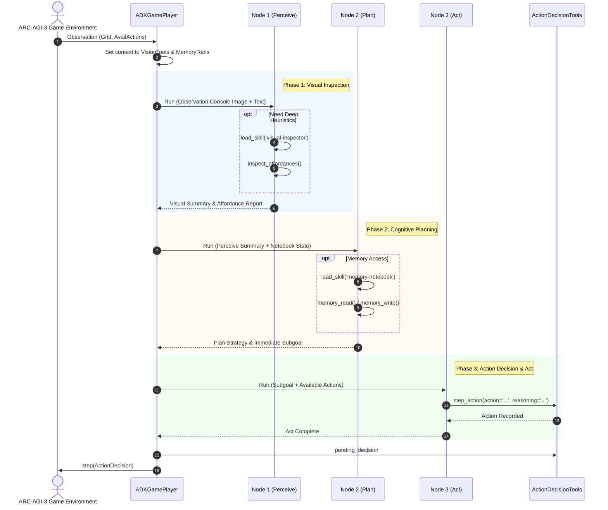

# Google ADK 2.0 準拠 3段階 Progressive Disclosure アーキテクチャ設計書

本ドキュメントは、`acr-agi3-edd-agent` において採用されている **Google ADK 2.0 準拠 3段階 Progressive Disclosure（段階的開示）アーキテクチャ** の設計思想、コンポーネント構成、ライフサイクル、および拡張ガイドラインを規定します。

---

## 1. 背景と設計課題 (Background & Motivation)

### 1.1 ARC-AGI-3 ゲームプレイの特性
ARC-AGI-3 は静的なグリッド変換問題（ARC-1/2）とは異なり、未知の動的環境におけるリアルタイムなゲームプレイです。エージェントは観測（Visual/State）からアフォーダンスを認識し、推論し、1手（`UP`, `DOWN`, `ACTION1`〜`ACTION7` 等）を行動（Act）として選択する必要があります。

### 1.2 従来の課題
1. **コンテキスト肥大化と推論遅延**:
   すべてのスキル指示・ヒューリスティクス・API仕様を単一プロンプトに常時注入すると、ステップごとに数千トークンを浪費し、ローカル小型 VLM（Qwen2.5-VL 等）のアテンション低下および GPU 推論遅延を招く。
2. **自己幻覚ループ（Self-Hallucination Loop）**:
   モデルが単一の生成ターンで `<tool_call>` と偽の `<tool_response>` を自作自演し、推論エンジンが停止せず CPU/GPU を占有し続ける。
3. **未検証・曖昧な行動出力**:
   モデルが自由形式テキストや不完全な JSON で行動を出力したり、ツール未提供時に `load_skill(skill_name='ACTION1')` とスキルローダーを行動実行と誤認して呼び出す無限リトライループが発生する。

---

## 2. 3段階 Progressive Disclosure 設計思想

Google ADK 2.0 の仕様に基づき、エージェントへの情報開示と実行権限を厳格に 3 段階へ分離します。

```
┌─────────────────────────────────────────────────────────────┐
│ Level 1: Metadata Catalog (常駐: 極小トークン消費)           │
│   - load_skills_from_dir でロードされた Frontmatter カタログ │
│   - name, description, inputs, outputs をエージェントが俯瞰  │
└──────────────────────────────┬──────────────────────────────┘
                               │ 自律判断によりスキルをトリガー
                               ▼
┌─────────────────────────────────────────────────────────────┐
│ Level 2: Instructions (オンデマンド展開: SKILL.md 本文)      │
│   - load_skill(skill_name='...') で該当スキルの指示を展開    │
│   - 思考プロトコル、ワークフロー、定石、境界条件を理解      │
└──────────────────────────────┬──────────────────────────────┘
                               │ 思考の具現化・環境への介入
                               ▼
┌─────────────────────────────────────────────────────────────┐
│ Level 3: Execution Tools (オンデマンド実行: Python ツール)   │
│   - metadata.adk_additional_tools で定義された実行ツール群   │
│   - 型安全な引数検証・環境への確実なアクション確定           │
└─────────────────────────────────────────────────────────────┘
```

---

## 3. システムアーキテクチャ

### 3.1 ノード構成と責任分担 (3-Node Modular Pipeline)

`ADKGamePlayer` は 1 手を決定するために、専門化された 3 つのエージェント（Node）をパイプライン実行します。

| ノード名 | 役割 | 関連スキル | Level 3 実行ツール |
|---|---|---|---|
| **Node 1: Perceive Agent** (`_perceive`) | 盤面視覚解析・客観的幾何抽出・アフォーダンス特定 | `visual-inspector` | `inspect_affordances`<br>`inspect_board_summary` |
| **Node 2: Plan Agent** (`_plan`) | 逆算プランニング・仮説生成・長期記憶ノート管理 | `memory-notebook` | `memory_write`<br>`memory_read`<br>`memory_toc`<br>`memory_search` |
| **Node 3: Act Agent** (`_act`) | 安全性検証・1手の最終決定・環境操作実行 | `game-controller` | `step_action`<br>`click_at`<br>`reset_game` |



---

## 4. 行動決定の安全防壁と不変条件 (Safety Invariants)

### 4.1 行動実行の厳格なツール経由原則
エージェントがゲーム環境に対して行うすべての操作（方向移動、クリック、リセット）は、**必ず Level 3 実行ツールを経由して呼び出されなければなりません**。

1. **自由形式テキスト／JSONパースの禁止**:
   LLM の自由記述テキストから正規表現でアクションを取り出す設計は廃止。行動は `ActionDecisionTools.step_action` 等のツール呼び出しとして明示的にインターセプトされます。
2. **`load_skill` 誤認呼び出しの自動補正**:
   VLM がアクション名を行動ツールではなく `load_skill(skill_name='ACTION1')` として発行しようとした場合、推論アダプター（`LocalVlmEngine._detect_tool_call`）が自動的に `step_action(action='ACTION1')` へ書き換えてフェイルセーフを実行します。
3. **自己幻覚停止（Autoregressive Guard）**:
   `LocalVlmEngine` は第 1 の `</tool_call>` を検出した直後にテキスト生成を強制打ち切り、モデルが偽の `<tool_response>` を生成して無限ループに陥るのを物理的に防止します。

---

## 5. メタスキルのディレクトリ構造と規約

すべてのスキルは上流 EDD 規約に準拠し、以下の標準構造を持ちます。

```
meta_skills/<skill-name>/
├── SKILL.md              # [必須] YAML Frontmatter + Markdown 指示本文
├── scripts/              # [Level 3] 実行用 Python モジュール
│   └── <skill_logic>.py
└── tests/                # [必須] 契約テスト（正例3件＋負例3件）
    └── test_<skill>.py
```

### 5.1 `SKILL.md` Frontmatter 規約
Level 3 実行ツールを宣言する場合、`metadata.adk_additional_tools` フィールドに公開ツール関数名をリストします。

```yaml
---
name: game-controller
description: "ARC-AGI-3 動的ゲーム環境における1手アクション実行とゲーム制御スキル..."
inputs:
  - action: "実行するゲームアクション（例: UP, DOWN, ACTION1..ACTION7）"
  - reasoning: "この1手を選択した認知的理由"
outputs:
  - status: "アクション受理状態"
allowed-tools:
  - step_action
  - click_at
  - reset_game
metadata:
  adk_additional_tools:
    - step_action
    - click_at
    - reset_game
---
```

---

## 6. スキルの作成・検証・拡張ワークフロー

### 6.1 新規スキルの作成 (MCP: `edd_init_skill`)
```bash
call_mcp_tool(
    ServerName="edd-agent",
    ToolName="edd_init_skill",
    Arguments={"name": "new-skill-name", "path": "generated_skills"}
)
```

### 6.2 静的規約検証 (MCP: `edd_validate_skill`)
作成・編集したスキルは、コミット前に必ず検証を実行し、エラー 0 件・警告 0 件を確認します。
```bash
call_mcp_tool(
    ServerName="edd-agent",
    ToolName="edd_validate_skill",
    Arguments={"skill_dir": "meta_skills/game-controller"}
)
```

### 6.3 契約テストの実行 (pytest)
```bash
pytest meta_skills/<skill-name>/tests/
```

---

## 7. 将来の拡張性 (Extensibility Roadmap)

本アーキテクチャにより、今後新たなメタスキル（例: `epistemic-prober`, `backward-planner`, `taboo-reset-guard`, `macro-skill-compiler`）を本番投入する際も、コアエージェントを変更することなく：
1. `meta_skills/<skill>/SKILL.md` にプロトコルを記述
2. `src/acr_agi3/tools/<tool>.py` に Level 3 実行ツールを実装
3. Agent の `additional_tools` にバインド

するだけで、コンテキストトークンを消費せずに段階的開示（Level 1 -> Level 2 -> Level 3）される純粋な ADK 2.0 スキルとして自律利用が可能になります。
